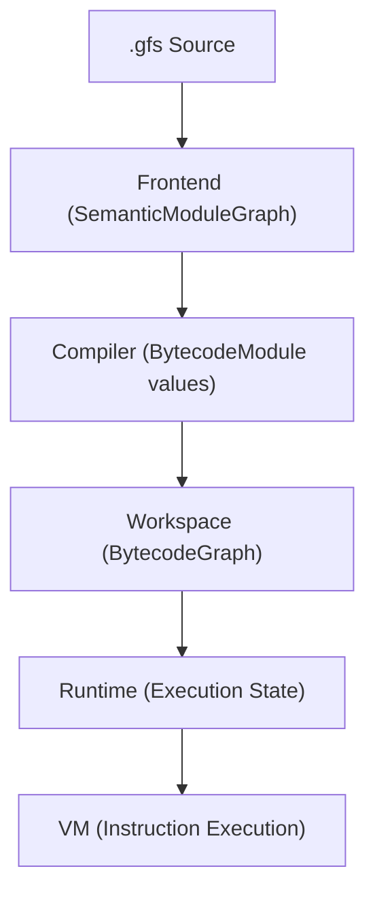

# Galfus Architecture Reference

## 1. Core Identity

Galfus Script is a typed, VM-first scripting language with a straightforward pipeline. The primary pipeline is:

**What is implemented:**

- Full compiler pipeline (parsing to bytecode)
- In-memory `BytecodeGraph` execution
- Deterministic VM and memory graph
- Optional Host Providers boundary

**What is NOT part of the current architecture:**

- **Bundler:** Not implemented.
- **Optimizer:** Not implemented.
- **Debugger:** Not implemented.
- **JIT Compilation:** Not implemented.

---

## 2. The Semantic Graph

The `SemanticModuleGraph` represents the source-level meaning of the workspace.
It contains modules, symbols, typed references, and diagnostics.
The frontend processes source text and updates this graph.

---

## 3. The Bytecode Module

`BytecodeModule` is the isolated executable unit.
Each module contains its private and exported functions, globals, constants, layouts, and bytecode.
There is no global shared namespace. A variable without `export` belongs strictly to its module.

---

## 4. The Bytecode Graph

`BytecodeGraph` represents the complete executable program.
It contains multiple `BytecodeModule`s and their dependencies.
It is the only executable graph. The runtime does not rebuild or duplicate this graph.

The compiler produces a updated modules for changed modules. The
workspace applies it only to the declared graph version, validates the complete
result, and then publishes the next snapshot. Failed or stale transactions
leave the prior snapshot unchanged.

---

## 5. The Workspace

The `Workspace` owns the current architectural snapshots:

- Source state
- `SemanticModuleGraph` snapshot
- `BytecodeGraph` snapshot

It manages the orchestration of the frontend, compiler, and provides an API for embedding.

---

## 6. Runtime and VM

The runtime executes an `Arc<BytecodeGraph>` with optional `Providers` and
optional `Adapters`.
Execution state lives in the VM and is partitioned by `ModuleId`, including
globals and initialization status. Dependencies initialize before the entry
module, and the runtime does not duplicate bytecode.

The `VM` executes bytecode instructions. It receives frames containing `ModuleId`, `FunctionId`, and `InstructionOffset`. Execution is implemented fundamentally via a `step` function that runs one instruction at a time.

Virtual threads provide cooperative concurrent execution. Each thread has an
isolated heap and mailbox; the runtime registry retains its identity, lifecycle
state, key, and mailbox while it is created, running, blocked, or exited.

### Cooperative Scheduler (Optional)

> [!NOTE]
> The `CooperativeDriver` provided by the Galfus engine is entirely **optional**. It serves merely as a quick, ready-to-use scheduler to embed Galfus in simple applications or tests. For advanced use cases, you are encouraged to write your own custom executor by implementing the `KernelDriver` trait.

The scheduler is implemented as a **FIFO queue** (`CooperativeDriver` backed by
a `VecDeque`). Threads are dispatched in arrival order — no thread can skip
ahead of another. Each scheduling cycle dequeues one thread, runs it for a
fixed instruction budget, and either re-enqueues it (still runnable) or
transitions it to a suspended state.

**Thread states:**

| State    | Description                                                            |
| :------- | :--------------------------------------------------------------------- |
| Runnable | In the FIFO queue, will be picked up in the next scheduling cycle.     |
| Running  | Currently executing its instruction budget on the driver.              |
| Blocked  | Suspended in `BlockedQueue`, waiting for an external event or timeout. |
| Exited   | Function returned; exit code is stored in the registry.                |

**I/O suspension:** A provider call first creates a lazy `Future` activation.
When the future is awaited, the thread is suspended and its continuation is
stored. The provider task is dispatched to the **back** of the FIFO queue so
the scheduler remains fair. When the activation completes, the thread is
resumed at the front of the queue to continue promptly.

### Waiter Mechanism (`Thread::wait`)

`Thread::wait` implements join semantics through an internal lazy future,
without busy-waiting:

1. The `std/thread` implementation creates the `__internal_thread_wait`
   activation and returns its future.
2. When that future starts, the orchestrator checks if the target is already
   `Exited`.
   - **Yes**: Resumes the caller immediately with the stored exit code.
   - **No**: Calls `kernel.block(caller)` and registers the caller in a
     `waiters: HashMap<ThreadId, Vec<WaiterEntry>>` on the `VirtualKernel`.
3. When the target thread exits (the `Exited` runtime event fires),
   the wait future is completed. Each awaiting thread is taken from the
   registry and resumed at the front of the FIFO queue with the exit code as
   its result.

---

## 7. Providers

Providers represent the boundary between Galfus and the host platform.
The provider surface is asynchronous and message-based. Concrete capabilities
are supplied by the embedding host.
If a provider is not supplied, related builtin calls will fail deterministically, allowing trivial sandboxing.

---

## 8. Execution Metadata

Each `BytecodeNode` may contain optional `ExecutionMetadata` with instruction
spans. Execution failures retain VM frames with module ID, function index, and
instruction offset across asynchronous suspension. The current structured
failure API does not expose resolved source spans directly.
Function-symbol and source-path mappings are planned metadata extensions.

---

## 9. Architecture Invariants

Principles exist as objective contracts per layer. Each invariant must have at least one corresponding test or check.

- **Frontend**: Must produce a canonical, deterministic `SemanticModuleGraph`. No state leakage between compilations.
- **Package/Workspace**: Must maintain isolated module namespaces without implicit global dependencies.
- **VM**: Given the same initial state and the same ordered sequence of external completions, the VM must produce the same state transitions and effects.
- **Kernel**: The Kernel must apply a canonical scheduling policy with stable ordering and explicit tie-break rules.
- **Host**: The Host must validate requests; deliver explicit completions; never modify VM state directly; and fail explicitly when a provider or function does not exist.

---

## 10. Runtime Ownership Matrix

Without an authoritative source, new features can duplicate cleanup or leave features unowned. Every new runtime entity must update this matrix.

| Entity              | Created by     | Authoritative owner           | Transfer trigger        | Terminal states                | Cancellation/failure cleanup | Final release  |
| ------------------- | -------------- | ----------------------------- | ----------------------- | ------------------------------ | ---------------------------- | -------------- |
| **Thread state**    | Kernel/runtime | Kernel                        | Scheduling transition   | Completed, Failed, Cancelled   | Kernel                       | Kernel         |
| **Future value**    | VM/runtime     | Future registry               | Completion delivery     | Resolved, Failed, Cancelled    | Registry                     | Registry       |
| **Request**         | Runtime        | Host boundary while in flight | Dispatch/completion     | Completed, Rejected, Cancelled | Boundary/runtime             | Runtime        |
| **Completion**      | Host           | Host boundary                 | Delivery to injector    | Delivered, Dropped             | Boundary                     | Runtime        |
| **Timer**           | Runtime/kernel | Timer registry                | Expiration/cancellation | Fired, Cancelled               | Timer registry               | Timer registry |
| **External handle** | Provider       | Provider/handle registry      | Explicit release        | Released, Invalidated          | Provider boundary            | Provider       |
