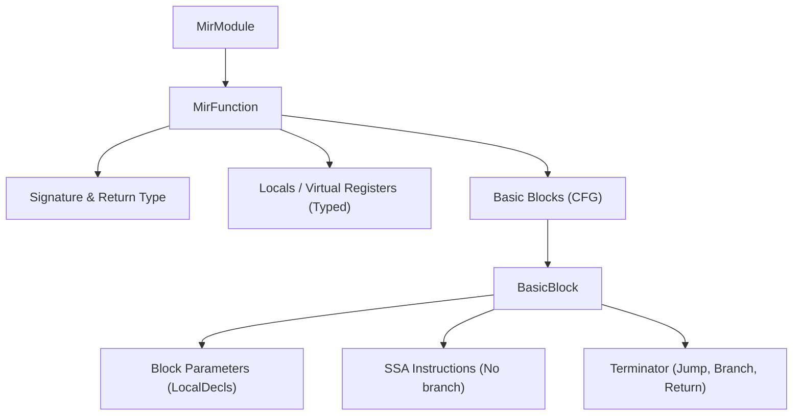

# Galfus MIR (Medium Intermediate Representation) Specification

This document defines the architecture, design, and key structures of the Galfus Medium Intermediate Representation (MIR), incorporating the architectural choices decided for the compiler pipeline.

---

## 1. Architectural Decisions

Based on the compiler requirements and design goals, the MIR is specified as:

1. **SSA (Static Single Assignment) with Block Parameters**: Every virtual register is assigned exactly once. Merging control flow uses block parameters (arguments passed to blocks) rather than traditional $\phi$ (phi) nodes, which simplifies liveness calculations.
2. **Flattened Control Flow Graph (CFG)**: Instead of maintaining hierarchical AST-like structures (`If`, `Loop`), the MIR body is lowered into a flattened list of `BasicBlock`s connected by explicit `Jump` and `Branch` terminators.
3. **Implicit Owner Graph Integration**: The MIR focuses on pure computation and generic `Drop(x)` statements where lifetimes end. The VM and the bytecode generator infer ownership graph updates (anchors, edges, weak links) for values allocated in the current thread's private heap.

---

## 2. Core Structure of MIR

The MIR of a module represents a translated `.gfs` file.



### 2.1 Virtual Registers (Locals)

All values (including parameters, local variables, and intermediate results) are stored in typed, immutable virtual registers (`LocalId`).

- Each local has a unique name/ID (e.g. `_0`, `_1`).
- Re-assignments in the source code are lowered to new virtual registers, preserving SSA form.

---

## 3. Structural Control Flow & Scope Definitions

The MIR body is structured into a flattened graph of `BasicBlock`s. 

```rust
pub struct BasicBlock {
    pub id: BlockId,
    pub parameters: Vec<LocalDecl>,
    pub instructions: Vec<(Instruction, Option<galfus_core::Span>)>,
    pub terminator: (Terminator, Option<galfus_core::Span>),
}
```

### 3.1 Block Parameters

To merge values at join points (such as the end of an `if-else` block returning a value), blocks define parameters. A jump/branch terminator supplies the values for these parameters, which are bound to new SSA virtual registers when entering the block.

---

## 4. Key Data Forms

### 4.1 Operands & Constants

```rust
pub enum Operand {
    /// A literal constant (e.g. 10, true, "text", null)
    Constant(Constant),
    /// A reference to a constant pool index
    ConstRef(usize),
    /// A virtual register
    Local(LocalId),
}
```

### 4.2 RValues (Right-Hand Side Expressions)

An `RValue` is a single computational step, usually assigned to a virtual register.

```rust
pub enum RValue {
    Use(Operand),
    UnaryOp(MirUnaryOp, Operand),
    BinaryOp(MirBinaryOp, Operand, Operand),
    Cast(Operand, TypeId),
    Copy(Operand),
    
    // Allocations
    NewStruct { struct_type: TypeId, fields: Vec<Operand> },
    NewArray(TypeId, Vec<Operand>),
    NewArrayDynamic(TypeId, Vec<ArrayLiteralElement>),
    NewArrayZeroed { array_type: TypeId, element_type: TypeId, size: usize },
    NewArrayZeroedDynamic { array_type: TypeId, element_type: TypeId, length: Operand },
    NewTuple(TypeId, Vec<Operand>),
    
    // Access & Check
    MemberAccess(Operand, String),
    ArrayIndex(Operand, Operand),
    Choice(TypeId, String, Option<Operand>),
    ChoiceVariantIs(Operand, SymbolId),
    Instanceof(Operand, TypeId),
    LoadGlobal(String),
    Len(Operand),
    
    // Futures
    CreateFuture { func: FunctionId, args: Vec<Operand>, is_external: bool },
    CreateIndirectFuture { func: Operand, args: Vec<Operand> },
}
```

### 4.3 Instructions & Terminators

An instruction is a statement-level action or a state assignment. Wait/yield states (like Await) are also instructions in the MIR, as they do not diverge control flow from the perspective of the CFG.

```rust
pub enum Instruction {
    /// Assign the result of an RValue to an SSA register
    Assign(LocalId, RValue),
    /// Explicitly end the lifetime of an SSA register (triggers drop in the VM)
    Drop(LocalId),
    
    // Side-effects
    StoreGlobal(String, Operand),
    StoreIndex { arr: Operand, idx: Operand, val: Operand },
    StoreField { obj: Operand, field_name: String, val: Operand },
    
    // Synchronous calls
    Call { func: FunctionId, args: Vec<Operand>, destination: LocalId, is_external: bool },
    IndirectCall { func: Operand, args: Vec<Operand>, destination: LocalId },
    ConstraintCall { method_name: String, obj: Operand, args: Vec<Operand>, destination: LocalId },
    
    // Asynchronous waits
    Await { future: Operand, destination: LocalId },
    AwaitAll { futures: Vec<Operand>, destination: LocalId },
    AwaitRace { futures: Vec<Operand>, destination: LocalId },
}
```

A terminator completes a `BasicBlock` and dictates where control flow goes next:

```rust
pub enum Terminator {
    Return(Option<Operand>),
    Jump {
        target: BlockId,
        args: Vec<Operand>,
    },
    Branch {
        cond: Operand,
        true_block: BlockId,
        true_args: Vec<Operand>,
        false_block: BlockId,
        false_args: Vec<Operand>,
    },
    Panic(String),
}
```

---

## 5. Implicit Memory & Ownership (Owner Graph)

The Owner Graph is managed implicitly by the VM and the bytecode generator using **Type Metadata** and **Life Boundaries**:

1. **Allocation**: Instructions like `NewStruct` allocate exclusively on the current thread's private heap.
2. **Deterministic Drops**: The compiler inserts `Drop(local)` at the exact point in the MIR where the local variable's virtual register is no longer alive (computed via SSA liveness analysis).
3. **VM Execution**: The VM interprets `Drop(local)` and implicitly:
   - Breaks any outgoing ownership edges (`edges`).
   - If the target loses all incoming ownership connections (`anchors`), the VM triggers the destruction schedule.
   - Cleans up weak links (`weak`).
