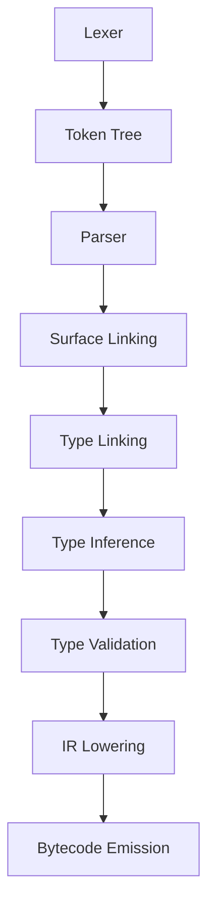
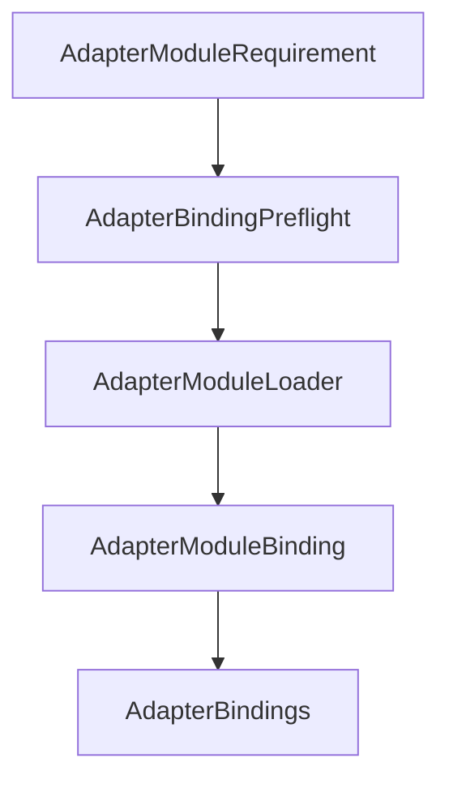
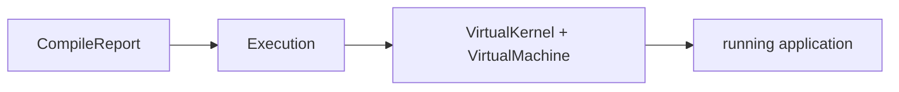
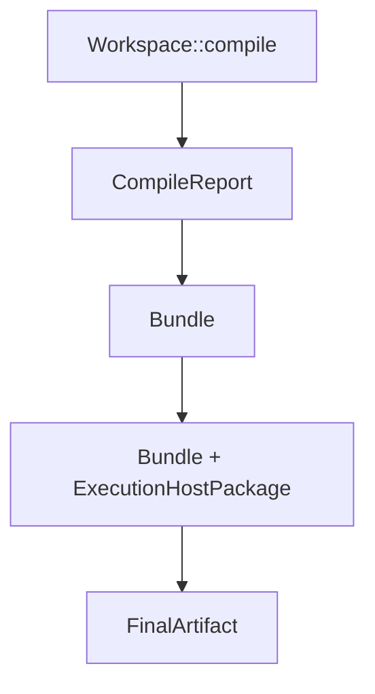

# Galfus Architecture Glossary

This glossary standardizes the names used by the Galfus architecture. It is a naming contract for code, documentation, issues, and diagrams.

## Status legend

| Status      | Meaning                                                         |
| ----------- | --------------------------------------------------------------- |
| **Defined** | Accepted as the canonical project term.                         |
| **Working** | Currently useful, but its final contract or name is not closed. |

## Product and source files

| Term                                          | Status  | Definition                                                                                                                                            |
| --------------------------------------------- | ------- | ----------------------------------------------------------------------------------------------------------------------------------------------------- |
| **Galfus**                                    | Defined | The complete language ecosystem, including the language, compiler, runtime, VM, hosts, tooling, and distribution formats.                             |
| **Galfus Script**                             | Defined | The Galfus programming language and its source-level contracts.                                                                                       |
| **Fusy**                                      | Defined | The Galfus mascot. It is a brand identity, not an architectural component.                                                                            |
| **Galfus Source Module** (`.gfs`)             | Defined | A regular Galfus source module containing declarations and executable language code.                                                                  |
| **Galfus Proxy Module** (`.gfp`)              | Defined | A declarative module that exposes a Galfus surface backed by an implementation loaded through a host adapter. It is lowered before runtime execution. |
| **Project Configuration** (`WorkspaceConfig`) | Defined | The TOML configuration loaded by a `Workspace` to describe the project and selected build target.                                                     |
| **Module Path**                               | Defined | The canonical logical identity of a module inside a workspace or catalog. It is independent of an operating-system file path.                         |

## Workspace and frontend

| Term          | Status  | Definition                                                                                                                                                       |
| ------------- | ------- | ---------------------------------------------------------------------------------------------------------------------------------------------------------------- |
| **Workspace** | Defined | The host-agnostic facade used to load configuration and modules, perform checks, compile, and coordinate execution. Loading or changing an input marks it dirty. |

| **Source Store** (`SourceStore`) | Defined | The workspace-owned source collection. It distinguishes user modules, internal builtins, and catalog-provided schemas so catalog changes can be applied safely. |
| **Dirty State** | Defined | The state after any relevant input changes. Compilation is blocked until a successful check clears it. |
| **Diagnostic** | Defined | An observational compiler finding. Diagnostics report invalid source or contracts without silently repairing the semantic model. |
| **Frontend Snapshot** (`FrontendSnapshot`) | Defined | An immutable, coherent view of frontend results for one exact workspace and catalog revision. It may retain parsed modules, the `ModuleGraph`, linked surfaces and types, the `SemanticGraph`, and diagnostics so checks and language tooling can reuse them incrementally. It is derived cache state—not a source of truth, runtime snapshot, or distributable artifact—and must be invalidated when any contributing input changes. Its exact contents and granularity are still being defined. |

## Compiler pipeline

The canonical frontend and compilation order is:



| Term                                              | Status  | Definition                                                                                                                                           |
| ------------------------------------------------- | ------- | ---------------------------------------------------------------------------------------------------------------------------------------------------- |
| **Lexer**                                         | Defined | Converts source text into a flat token stream.                                                                                                       |
| **Token Tree** (`TokenTree`)                      | Defined | Groups tokens by `()`, `{}`, and `[]` before parsing, providing explicit nesting and better recovery boundaries.                                     |
| **Parser**                                        | Defined | Converts token trees into the syntactic representation of a module.                                                                                  |
| **Module AST** (`ModuleAst`)                      | Defined | The parsed syntax of one source module. It describes source structure, not resolved meaning.                                                         |
| **Module Graph** (`ModuleGraph`)                  | Defined | A type alias for `ModuleAst`. It represents the graph of syntax nodes, scopes, and types for a single parsed module.                                 |
| **Surface Linking** (`surface_linking`)           | Defined | Connects public module surfaces across imports and exports. It establishes which declarations can be reached, without completing inferred types.     |
| **Type Linking** (`type_linking`)                 | Defined | Resolves explicit type references across linked module surfaces.                                                                                     |
| **Type Inference** (`type_inference`)             | Defined | Completes types that are intentionally omitted and can be inferred from program semantics.                                                           |
| **Type Validation** (`type_validation`)           | Defined | Observes the completed semantic model and emits diagnostics. It must not fill in, repair, or mutate types.                                           |
| **Semantic Module Graph** (`SemanticModuleGraph`) | Defined | The cross-module semantic representation used by type analysis, diagnostics, and language tooling such as the LSP.                                   |
| **IR Lowering** (`ir_lowering`)                   | Defined | Lowers the validated semantic representation into the intermediate representation.                                                                   |
| **Mid-level Intermediate Representation** (`MIR`) | Defined | A backend-independent executable representation. It is deliberately decoupled from bytecode so it can later feed the VM, a JIT, or LLVM compilation. |
| **Bytecode Emission** (`bytecode_emission`)       | Defined | Emits VM bytecode from the lowered representation.                                                                                                   |

## Compiled program model

| Term                                   | Status  | Definition                                                                                                                                                                                                |
| -------------------------------------- | ------- | --------------------------------------------------------------------------------------------------------------------------------------------------------------------------------------------------------- |
| **Bytecode Module** (`BytecodeModule`) | Defined | The bytecode unit that preserves a module boundary, including private root declarations and exported surface.                                                                                             |
| **Bytecode Graph** (`BytecodeGraph`)   | Defined | The complete graph of bytecode modules and their resolved relationships, suitable for optimization and VM consumption.                                                                                    |
| **Package Image** (`PackageImage`)     | Defined | The immutable, host-agnostic compiled image of one Galfus application. It contains the `BytecodeGraph`, entry point, adapter module requirements, and execution metadata, but no concrete host resources. |
| **Compile Report** (`CompileReport`)   | Defined | The result of a compile attempt. It carries diagnostics and, on success, a `PackageImage`.                                                                                                                |
| **Optimizer**                          | Defined | Transforms and prunes a compiled graph without changing its observable behavior. It may produce a smaller or more efficient `PackageImage`.                                                               |

Recommended relationship:

```rust
pub struct CompileReport {
    pub package: Option<PackageImage>,
    pub diagnostics: Vec<Diagnostic>,
}
```

## Capabilities, providers, and adapters

| Term                                                        | Status  | Definition                                                                                                                                                                                                                                 |
| ----------------------------------------------------------- | ------- | ------------------------------------------------------------------------------------------------------------------------------------------------------------------------------------------------------------------------------------------ |
| **Capability**                                              | Defined | A host feature intentionally made available to a Galfus program. Absence is valid and keeps the corresponding boundary unavailable.                                                                                                        |
| **Capability Catalog** (`CapabilityCatalog`)                | Defined | The authoritative, declarative set of provider module schemas and adapter schemas offered for a workspace. Its semantic fingerprint invalidates stale derived state.                                                                       |
| **Provider Module Schema** (`ProviderModuleSchema`)         | Defined | A catalog entry containing a provider module path and its declarative `.gfs` source. It defines a surface without containing a concrete implementation.                                                                                    |
| **Provider**                                                | Defined | A concrete host implementation of a declarative capability surface, commonly used for controlled access to host facilities such as I/O.                                                                                                    |
| **Provider Bindings** (`ProviderBindings`)                  | Defined | The concrete provider implementations installed in an execution environment. Use this only for provider-backed language modules; do not confuse it with adapter bindings created for `.gfp` modules.                                       |
| **Internal Builtin Module**                                 | Defined | An engine-owned module available without a host provider. A host capability such as `std/io` must not become an implicit builtin.                                                                                                          |
| **Adapter**                                                 | Defined | A named host integration protocol used by `.gfp` proxy modules. The adapter family owns configuration validation and loading semantics; the Galfus core only preserves its configuration and routes requirements to the registered loader. |
| **Adapter Schema** (`AdapterSchema`)                        | Defined | The catalog contract that recognizes an adapter name and validates the opaque configuration of `.gfp` modules using that adapter.                                                                                                          |
| **Adapter Configuration** (`AdapterConfig`)                 | Defined | A deterministic, structured, adapter-owned configuration tree. The core preserves it but does not interpret its keys.                                                                                                                      |
| **Proxy Function Signature** (`ProxyFunctionSignature`)     | Defined | A callable signature declared by a `.gfp` proxy module that its adapter-loaded implementation must satisfy.                                                                                                                                |
| **Adapter Module Descriptor** (`AdapterModuleDescriptor`)   | Defined | The parsed contract of a `.gfp` module: adapter identity, opaque configuration, and exported proxy signatures.                                                                                                                             |
| **Adapter Module Requirement** (`AdapterModuleRequirement`) | Defined | A compiled statement that a `PackageImage` needs one proxy module to be loaded through a named adapter.                                                                                                                                    |
| **Adapter Load Context** (`AdapterLoadContext`)             | Defined | Host-supplied properties available to adapter loaders, such as OS, architecture, family, or target triple. The Galfus core does not assign meaning to those properties.                                                                    |
| **Adapter Module Loader** (`AdapterModuleLoader`)           | Defined | A host-registered implementation selected by adapter name. It receives the complete requirement and load context, interprets the adapter configuration, and returns a module binding.                                                      |
| **Adapter Module Binding** (`AdapterModuleBinding`)         | Defined | A successfully loaded implementation that satisfies calls from one `.gfp` proxy module.                                                                                                                                                    |
| **Adapter Bindings** (`AdapterBindings`)                    | Defined | The collection of adapter module bindings, indexed by proxy module, ready to be installed in the runtime.                                                                                                                                  |
| **Adapter Binding Preflight** (`AdapterBindingPreflight`)   | Defined | The orchestration step that resolves each adapter module requirement to a registered loader and builds `AdapterBindings` before execution begins. It does not interpret adapter configuration or select platform artifacts itself.         |
| **Adapter Load Error** (`AdapterLoadError`)                 | Defined | A loader-owned error with a stable code and human-readable message. Adapter-specific failures do not become core error variants.                                                                                                           |

The canonical adapter-loading flow is:



### Provider versus adapter

| Provider path                                                     | Adapter path                                                                            |
| ----------------------------------------------------------------- | --------------------------------------------------------------------------------------- |
| Surface comes from declarative `.gfs` in the `CapabilityCatalog`. | Surface and adapter selection come from a `.gfp` module.                                |
| Concrete implementation is a host provider.                       | Concrete implementation is produced by an `AdapterModuleLoader`.                        |
| Intended for controlled host capabilities.                        | Intended for arbitrary host integration through proxy modules.                          |
| Does not imply a separate artifact.                               | May load a library, WASM component, remote bridge, or another adapter-defined resource. |

## Execution

| Term                                   | Status  | Definition                                                                                                                                                                                         |
| -------------------------------------- | ------- | -------------------------------------------------------------------------------------------------------------------------------------------------------------------------------------------------- |
| **Virtual Machine** (`VirtualMachine`) | Defined | Executes Galfus bytecode. It owns bytecode-level mechanics, not host capability policy.                                                                                                            |
| **Virtual Kernel** (`VirtualKernel`)   | Defined | Manages execution state and services around the VM, including installed bindings and lifecycle coordination. It remains host-agnostic.                                                             |
| **Execution** (`Execution`)            | Defined | The concrete environment capable of executing bytecode. It composes the runtime, VM, provider bindings, registered adapter module loaders, and platform configuration.                             |
| **Execution Host** (`ExecutionHost`)   | Defined | The concrete environment capable of executing a `PackageImage`. It composes a `PackageImageLoader`, runtime, VM, provider bindings, registered adapter module loaders, and platform configuration. |
| **Native Execution Host**              | Defined | An execution environment implemented for native operating systems. Suggested crate name: `galfus-host-native`.                                                                                     |
| **Web Execution Host**                 | Defined | An execution environment implemented for the web/WASM environment. Suggested crate name: `galfus-host-web`.                                                                                        |

Canonical boundary:



An `Execution` is not synonymous with `VirtualKernel`: the kernel is one host-agnostic component inside it.

## Packaging and distribution

| Term                                                | Status  | Definition                                                                                                                                                                                                                                  |
| --------------------------------------------------- | ------- | ------------------------------------------------------------------------------------------------------------------------------------------------------------------------------------------------------------------------------------------- |
| **Bundle**                                          | Defined | The serialized distribution wrapper around a compiled program. It adds a header, format and contract versions, integrity data, and optionally other packaged resources.                                                                     |
| **Bundle Header**                                   | Defined | The versioned envelope metadata used to identify the bundle contract and verify compatibility and integrity before decoding its contents.                                                                                                   |
| **Target**                                          | Defined | A configured build destination used to select an appropriate packaging and host strategy, such as web or native. It must not constrain adapter configuration keys.                                                                          |
| **Execution Host Package** (`ExecutionHostPackage`) | Defined | A prebuilt, downloadable package containing an `ExecutionHost` for a compatible target. It can be combined with a project bundle to produce the final executable, web application, or firmware. Initial target families are web and native. |
| **Final Artifact** (`FinalArtifact`)                | Defined | The closed executable, web application, or firmware produced by combining a bundle with the appropriate `ExecutionHostPackage`.                                                                                                             |

The planned distribution flow is:



The `CompileReport` provides the semantic compiled payload; the `Bundle` is its portable serialized envelope; the `ExecutionHostPackage` contributes target-specific execution machinery.

## Virtual concurrency vocabulary

These names belong to the planned concurrency model and remain **Working** until its contracts are implemented. Virtual threads are completely isolated and communicate exclusively through byte messages.

| Term                                           | Status  | Definition                                                                                                                                                                                                                                                         |
| ---------------------------------------------- | ------- | ------------------------------------------------------------------------------------------------------------------------------------------------------------------------------------------------------------------------------------------------------------------ |
| **Virtual Thread** (`VirtualThread`)           | Defined | A fully isolated Galfus execution unit concretized by the host. Each virtual thread owns its complete execution state and cannot access another thread's heap or data instances.                                                                                   |
| **Orchestrator Thread** (`OrchestratorThread`) | Defined | The distinguished virtual thread responsible for orchestration duties such as lifecycle coordination, scheduling decisions, and byte-message routing. It has no privileged access to another virtual thread's memory and does not imply ownership of an OS thread. |
| **Byte Message** (`ByteMessage`)               | Defined | The only communication payload exchanged between virtual threads. Its bytes cross the isolation boundary without sharing the sender's memory or object identity.                                                                                                   |

## Language-model terms already fixed

| Term                 | Status  | Definition                                                                                                                                               |
| -------------------- | ------- | -------------------------------------------------------------------------------------------------------------------------------------------------------- |
| **Tuple**            | Defined | A structured product value with named fields.                                                                                                            |
| **Choice**           | Defined | A tagged alternative type used to represent one of several variants.                                                                                     |
| **Decorator**        | Defined | A repeatable transformation function applied to supported declarations or choice tuple fields. It is not metadata. The closest decorator executes first. |
| **Stamped Function** | Defined | A function category that must not accept decorators.                                                                                                     |

## Naming rules

- Use **Galfus Script** for the language and **Galfus** for the ecosystem.
- Use PascalCase for Rust public types and conceptual identifiers shown as code.
- Use snake_case for internal Rust properties and compiler stage module names.
- Keep `PackageImage`, `Runtime`, and `ExecutionHost` distinct.
- Keep providers and adapters distinct.
- The core may preserve adapter configuration, but only a loader may interpret it.
- A target identifies a build destination; it does not define universal adapter keys.
- Use **linking** for cross-module resolution phases and **binding** for concrete runtime connections.
